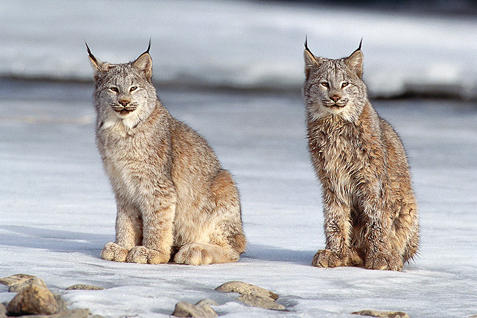

```{r setup, include=FALSE}
knitr::opts_chunk$set(echo = FALSE, cache = TRUE, warning=FALSE)
```

# Introduction (1 pg)

The Canadian Lynx, known scientifically as the _Lynx canadensis Kerr_, are a marvelous species found within British Columbia. For this report, a spatial analysis of this species will be conducted. They will be referred to as their shorter name, Lynx, for the duration of this report. Given that the Lynx are a part of the feline family, we hypothesize that they will habitate in forested areas, in small groups, with minimal movement. In other words, we expect that they will reside in an area long term without significant travelling or relocating. We also predict that they will reside in colder locations, so their presence may not be found in the warmer areas of BC, such as the southern interior. We expect that we cannot assume homogeneity for this specific species, as we expect the lynx to be found in clusters rather than evenly distributed across BC. We expect that the lynx would be found at higher elevations due to their thicker coats and natural behaviours.  



# Methods

## Dataset

The dataset contains 13 variables and there are 178 rows, or entries. The variables include `countryCode` (str, which have all been filtered to CA for Canada), `stateProvince` (str, filtered for British Columbia), `higherClassification` (str, additional species information). `month` (int, month of occurrence), `locality` (str, region description), `higherGeography` (str, more broad region), `sex` (str, contains male, female, or NA), `decimalLatitude` (float), `decimalLongitude` (float), `dateIdentified` (date-time value, date of identification), `coordinateUncertaintyInMeters` (int, uncertainty value), `footprintWKT` (list of int, measurement values), and `country` (str, filtered to Canada).

## Workflow 

To begin, first moment descriptive statistics were visualized. Basic `spatstat` features were used to transform to a `ppp` object, as well as visualize the spatial data on the appropriate window, which in this case, is the province of BC map. The elevation was also attached to the data, and basic elevation features were visualized on the window.   
After that we examined the intensity of lynx locations and assessed homogeneity through a quadrat test, which revealed that the distribution was not homogenous. We then used inhomogeneous k-function and pair correlation function to investigate the correlation of lynx locations. Then we fitted models and selected them based on AIC scores and likelihood ratio test. Furthermore, we performed a quadrat test to determine if the selected model accurately predicts the data or if there are deviations.  Additionally, we explored the potential benefits of adding other covariates to our models. To assess the efficacy of our models, partial residual plots were used to identify whether our model capturing the data well or not.


## Code

```{r, eval=FALSE, echo=TRUE}
#
```


# Results

## First Moment Descriptives

Below we will see a plot of Canadian Lynx within BC.

```{r}
lc <- read.csv("../datasets/processed/lc.csv")
# plot(decimalLatitude ~ decimalLongitude,
#      pch = 16,
#      col = "#046C9A",
#      data = lc,
#      main = 'Canadian Lynx Locations within BC')
```

We can visualize this by first showing the observation window, which is the province of BC.

```{r}
suppressMessages(library(spatstat))
suppressMessages(library(sf))
load("../datasets/raw/BC_Covariates.Rda")
# Create a SpatialPolygons object for the window
bc_window_sf <- st_as_sf(DATA$Window)
bc_window_owin <- as.owin(bc_window_sf)
# Visualize the window
# plot(bc_window_owin, main = "Observation Window")
```

Now we can overlay the two to show the observations within the window.

```{r}
# Convert to a ppp object
lc_ppp <- ppp(x = lc$decimalLongitude, # X coordinates
              y = lc$decimalLatitude, # Y coordinates
              window = bc_window_owin, # Observation window
              )
lc_ppp <- as.ppp(lc_ppp)
# Plot the ppp object
plot(lc_ppp, 
     pch = 16,
     cex = 0.5,
     cols = "#046C9A",
     main = "Marked Canada Lynx")
```


### Intensity

To determine the intensity of the Lynx across the region, we compute the value itself.

```{r}
intensity(lc_ppp)
```

This value means that there are 1.856026e-10 Lynx found per square meter in BC.

<!--
We can take this a step further by splitting the window into quadrants to determine if the intensity is evenly allocated or not.
-->

```{r}
#Split into a 10 by 10 quadrat and count points
Q <- quadratcount(lc_ppp,
                  nx = 2,
                  ny = 4)
# #Plot the output
# plot(lc_ppp,
#      pch = 16,
#      cex = 0.5,
#      cols = "#046C9A",
#      main = "Lynx locations")
# 
# plot(Q, cex = 2, col = "red", add = T)
```

We can also see the intensity with observations through quadratcount.

```{r}
#Plot the output Note the use of image = TRUE
plot(intensity(Q, image = T),
     main = "Lynx intensity")

plot(lc_ppp, pch = 16, cex = 0.6, cols = "white", add = T)

plot(lc_ppp, pch = 16, cex = 0.5, cols = "black", add = T)
```

### Plot on BC Map

```{r}
library(raster)
dmap1 <- density.ppp(lc_ppp, sigma = bw.ppl(lc_ppp),edge=T)
r1 <- raster(dmap1)
library(leaflet)
#make sure we have right CRS, which in this case is British National Grid
bc_crs <- "+proj=aea +lat_0=45 +lon_0=-126 +lat_1=50 +lat_2=58.5 +x_0=1000000 +y_0=0 +datum=NAD83 +units=m +no_defs"
crs(r1) <- sp::CRS(bc_crs)
# create a colour palet
pal <- colorNumeric(c("#41B6C4", "red"), values(r1),
  na.color = "transparent")

#and then make map
leaflet() %>% 
  addTiles() %>%
  addRasterImage(r1, colors = pal, opacity = 0.8) %>%
  addLegend(pal = pal, values = values(r1),
    title = "Canada Lynx in BC") 
```


From the plots above, it can be seen that the assumption of homogeneity is not appropriate for this dataset as the lynx tend to be clustered in certain areas of the study site, whereas others have no lynx at all.

Next, we can perform a quadrat test of homogeneity to determine if, statistically, the assumption of homogeneity is met.

```{r}
quadrat.test(Q)
```

The small p-value suggests that there is a significant deviation from homogeneity. So, the assumption of homogeneity is not met.

### Nearest Neighbour Distances

Now we can compute nearest neighbor distances.

```{r}
col_pal <- colorRampPalette(c('orange', 'green'))
# Calculate nearest neighbor distances
nn_dist <- data.frame(nndist(lc_ppp))
# Add distance to nearest neighbor mark
marks(lc_ppp) <- nn_dist
# Plot point pattern with distance to nearest neighbor mark
plot(lc_ppp, main = "Seperation Distance", 
     which.marks = NULL, 
     cols = col_pal(nrow(nn_dist)), #The colours of the points
     pch = 16)
```

We see in the plot above that there are many regions with very large distances between the nearest neighbours. This follows our hypothesis that they are nomadic creatures in small groups or alone.


## Second Moment Descriptives

Following this, second moment descriptive statistics were visualized.

### K-Function

The K-Function will be the first visualization of this section.

```{r, cache = TRUE}
# Estimate the k- function
k_lc <- Kest(lc_ppp)
# visualise the results
plot (k_lc, main = "Homogeneous K-Function", lwd = 2)
```

Here we can see that theoretical k-function $k_{pois}(r)$ deviates from other k-function corrections indicates clustering but these estimates assume homogeneity.

```{r, cache = TRUE}
# Bootstrapped CIs
# rank = 1 means the max and min
# values will be used for CI
E_lc <- envelope(lc_ppp , Kest , rank = 1, nsim = 19, fix.n = T)
# visualise the results
plot (E_lc , main = "Homogeneous K-function")
```

From this, we have evidence that suggests significant clustering, but these estimates assume homogeneity.

Now we can relax the homogeneity assumption.

```{r}
#Estimate intensity
lambda_lc <- density(lc_ppp, bw.ppl)
Kinhom_lc <- Kinhom(lc_ppp, lambda_lc)
# Estimate a strictly positive density
lambda_lc_pos <- density(lc_ppp, sigma=bw.ppl, positive=TRUE)
# Simulation envelope (with points drawn from the estimated intensity)
E_lc_inhom <- envelope(lc_ppp, 
                        Kinhom, 
                        simulate = expression(rpoispp(lambda_lc_pos)), 
                        correction="border", 
                        rank = 1, 
                        nsim = 19, 
                        fix.n = TRUE)
# visualise the results
plot(E_lc_inhom, xlim = c(0,320000), main = "Inhomogeneous K-function", lwd = 2)
```

When correcting for inhomogeneity, the clustering is not as strong homogeneous k-function. Clustering appears to exist in and around 0 to 125000 units and 275000 to 300000 units.

### Pair Correlation Function

The pair correlation function can be used next.

```{r}
#Simulation envelope (with points drawn from the estimated intensity)
pcf_lc_inhom <- envelope(lc_ppp, 
                          pcfinhom, 
                          simulate = expression(rpoispp(lambda_lc_pos)), 
                          rank = 1, 
                          nsim = 19)

# visualise the results
par(mfrow = c(1,2))
plot(pcf_lc_inhom, main = "Inhomogeneous g-function")
# Zoom in on range where significant deviations appear
plot(pcf_lc_inhom, xlim = c(0,20000), main = "", lwd = 2)
```

There appear to be more lynx than expected by random chance between 0 - 13500 as $g(r) > 1$. Beyond that, the locations of lynx appear not to exhibit any significant correlations.


## Relationships with covariates

We are usually interested in determining whether the intensity depends on a covariate(s). One simple approach to check for a relationship between inhomogeneous $\lambda(u)$ and a spatial covariate $Z(u)$ is via quadrat counting. We can create five elevation classes with equal width below.

Now we can look at the distribution of the elevation classes in the window, the province of BC.

```{r}
library(viridis)
library(viridisLite)
cols = terrain.colors(5)
# Create 5 elevation classes with equal width
elev_classes <- cut(DATA$Elevation, breaks = 5, labels = c("low", "low-medium", "medium", "high-medium", "high"))
#table(elev_classes[lc_ppp])
# Plot the elevation class image and overlay the lynx locations
# plot(elev_classes, col = cols, main = "Elevation Classes", par(bg="grey50", cex.main = 2, cex = 0.6))
# points(lc_ppp, pch = 16, cex = 0.6, col = "black")

# Create 5 forest classes with equal width
forest_classes <- cut(DATA$Forest, breaks = 5, labels = c("low", "low-medium", "medium", "high-medium", "high"))
#table(forest_classes[lc_ppp])
# plot(forest_classes, col = cols, main = "Forest Classes", par(bg="grey50", cex.main = 2, cex = 0.6))
# points(lc_ppp, pch = 16, cex = 0.6, col = "black")

# Create 5 human footprint index classes with equal width
hfi_classes <- cut(DATA$HFI, breaks = 5, labels = c("low", "low-medium", "medium", "high-medium", "high"))
#table(hfi_classes[lc_ppp])
# plot(hfi_classes, main = "Footprint Index Classes", par(bg="grey50", cex.main = 2, cex = 0.6))
# points(lc_ppp, pch = 16, cex = 0.5, col = "white")

# Create 5 dist water classes with equal width
dist_water_classes <- cut(DATA$Dist_Water, breaks = 5, labels = c("low", "low-medium", "medium", "high-medium", "high"))
#table(dist_water_classes[lc_ppp])
# plot(dist_water_classes, main = "Dist Water Classes", par(bg="grey50", cex.main = 2, cex = 0.6))
# points(lc_ppp, pch = 16, cex = 0.5, col = "white")

#plot all at once
par(mfrow = c(2,2))
par(mar=c(0,0,2,1))
#1
plot(elev_classes, col = cols, main = "Elevation Classes", par(bg="grey50", cex.main = 2, cex = 0.6))
points(lc_ppp, pch = 16, cex = 0.6, col = "black")
#2
plot(forest_classes, col = cols, main = "Forest Classes", par(bg="grey50", cex.main = 2, cex = 0.6))
points(lc_ppp, pch = 16, cex = 0.6, col = "black")
#3
plot(hfi_classes, main = "Footprint Index Classes", par(bg="grey50", cex.main = 2, cex = 0.6))
points(lc_ppp, pch = 16, cex = 0.5, col = "white")
#4
plot(dist_water_classes, main = "Dist Water Classes", par(bg="grey50", cex.main = 2, cex = 0.6))
points(lc_ppp, pch = 16, cex = 0.5, col = "white")
par(mfrow = c(1,1))
```

<!--
Similarly, we can create forest classes with equal width.

Now we can look at the distribution of the elevation classes in the window, the province of BC.

Similarly, we can create human footprint index classes with equal width.

We can see the plot of this as well.


Computing the same for water classes.
--> 

Based on a visual inspection, it appears that the heterogeneity observed in the data may be associated with a preference for certain elevations and distances from water.

More formally, in testing for relationships with covariates we are assuming that $λ$ is a function of $Z$, such that $$\lambda(u)=\rho(Z(u))$$

A non-parametric estimate of $\rho$ can be obtained via kernel estimation, available via the rhohat() function.

We can see the plot of Rho with elevation.

```{r cache=TRUE}
#Estimate Rho
hfi = DATA$HFI
rho_hfi = rhohat(lc_ppp, hfi)
distw = DATA$Dist_Water
rho_distw = rhohat(lc_ppp, distw)
elev = DATA$Elevation
rho_elev = rhohat(lc_ppp, elev)
forest = DATA$Forest
rho_forest = rhohat(lc_ppp, forest)

par(mfrow = c(2,2))
par(mar=c(0,0,2,1))
plot(rho_elev,
     main = "",
     xlab = "Elevation (m)", 
     xlim=c(0, 3600))
plot(rho_forest,
     main = "",
     xlab = "Forest Cover (%)")
plot(rho_hfi,
     main = "",
     xlab = "Human Footprint Index")
plot(rho_distw,
     main = "",
     xlab = "Distance to Water (m)")
par(mfrow = c(1,1))
```

There’s a non-linear relationship between elevation and lynx intensity. Majority of the lynx are at low elevations than would be expected by chance, fewer lynx at intermediate elevations and no lynx at high elevations.

```{r}
#correlation
cor.im(elev, forest, hfi, distw,  use = 'complete.obs')
```

The correlation coefficients are relatively weak. We can proceed without too much worry.

### Model Fitting

```{r}
# Convert to a ppp object
lc_ppp <- ppp(x = lc$decimalLongitude, # X coordinates
              y = lc$decimalLatitude, # Y coordinates
              window = bc_window_owin, # Observation window
              )
lc_ppp <- as.ppp(lc_ppp)

mu <- mean(DATA$Elevation)
stdev <- sd(DATA$Elevation)
Elevation_scaled <- eval.im((elev - mu)/stdev, DATA)
mu <- mean(DATA$Dist_Water)
stdev <- sd(DATA$Dist_Water)
Dist_Water_scaled <- eval.im((distw - mu)/stdev, DATA)


# intercept only
fit_intercept = ppm(lc_ppp ~ 1, data = DATA)

fit1 = ppm(lc_ppp ~ Elevation_scaled + I(Elevation_scaled^2) + hfi + I(hfi^2))
fit1
```

In the fit1 model we can see that the coefficients are significant. We can also check the AIC score and likelihood ratio test.

```{r}
AIC(fit1); AIC(fit_intercept)
```

```{r}
anova(fit_intercept, fit1, test = "LRT") #LRT
```

So based on AIC score and likelihood ratio test fit1 model is better.

```{r}
quadrat.test(fit1, nx = 2, ny = 4)
```

The small p value tells us that the data deviate significantly from the model’s predictions.

Let's check whether adding other covariates going to improve the model fit or not.

```{r}
#lurking variable plot
lurking(fit1, forest, type = "raw", cumulative = F, envelope = T, xlab = "Forest Coverage (%)" )
```

It appears that the forest coverage variable may not be significant in the model, hence we could investigate the impact of water distance instead.

```{r}
#lurking variable plot
lurking(fit1, Dist_Water_scaled, type = "raw", cumulative = F, envelope = T, xlab = "Water Distance" )
```

So, water distance is unrelated to trends in the residuals. We can diagnose our model further by partial residual plots to check how we can improve.

```{r}
#partial residuals
par_res_elev = parres(fit1, "Elevation_scaled")
par_res_hfi = parres(fit1, 'hfi')

par(mfrow = c(1,2))
plot(par_res_elev,
     legend = FALSE,
     lwd = 2,
     main = "",
     xlab = "Elevation Scaled")
plot(par_res_hfi,
     legend = FALSE,
     lwd = 2,
     main = "",
     xlab = "HFI")
par(mfrow = c(1,1))
```

From these figures we can see that the quadratic term of hfi is capturing the patterns in our data particularly well but we can improve the elevation by adding higher order plynomials.

```{r}
fit2 = ppm(lc_ppp ~ Elevation_scaled + I(Elevation_scaled^2) + I(Elevation_scaled^3) + hfi + I(hfi^2))
fit2
```

```{r}
AIC(fit1); AIC(fit2)
```

```{r}
anova(fit1, fit2, test = "LRT") #LRT
```

So the additional complexity supported by data.

```{r}
#partial residuals
par_res_elev = parres(fit2, "Elevation_scaled")
par_res_hfi = parres(fit2, 'hfi')

par(mfrow = c(1,2))
plot(par_res_elev,
     legend = FALSE,
     lwd = 2,
     main = "",
     xlab = "Elevation Scaled")
plot(par_res_hfi,
     legend = FALSE,
     lwd = 2,
     main = "",
     xlab = "HFI")
par(mfrow = c(1,1))
```

In addition, the inclusion of extra elevation polynomial term slightly enhances the accuracy of the model predictions.

Since the model is already performing well, we are not considering to add any additional complexity to it.

Plotting `ppm` predictions:

```{r}
#plotting ppm 
#plotting ppm prediction
plot(fit2,
     se = FALSE,
     superimpose = FALSE,
     n = 150)
plot(lc_ppp,
     pch = 16,
     cex = 0.5,
     cols = "green",
     add = TRUE)
```

There are still locations where the model seems to not be a particularly good match to the data, but it is actually performing reasonably well considering that we are predicting the locations of lynx in BC based on only elevation and human footprint index, and have no information on all of the many other factors that might influence lynx locations.

# Discussion (1 pg - brief summary of findings)

Many of our hypotheses were found to be true. We found in the plots that the assumption of homogeneity is not appropriate for this Lynx dataset because the Lynx were clustered in certain areas of the observation window, whereas other locations had no Lynx at all. We also found that Lynx are animals that travel in either small groups or nomadically, as the nearest neighbour distances were quite large, showing that they typically stick to their territory and are not located close by each other.

We expected that lynx would be found at higher elevations, but looking at the plots, this was not the case. However, we believe the data is slightly biased because it only includes lynx sightings by humans. As lynx typically avoid humans, and areas where humans reside (as showing in the HFI plot), we believe that the majority of locations where the lynx are found have not been observed in this data. Humans are typically not in higher elevation areas, so they would not observe these areas as frequently as lower elevation areas, so the observations of the lynx are not truly representative.

note - elevation was not predictive in any way in the model - the rho was being influenced by other things that were correlated

# References

GBIF.org (01 April 2023) GBIF Occurrence Download https://doi.org/10.15468/dl.zeymyk